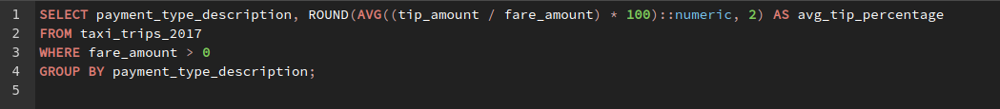

## Solutions

1. **What is the Average Fare Amount**

***
2. **What is the Total Trip Distance**

***
3. **What are the longest and shortest trips**

***
4. **Check store and forward flags**

***   
5. **Calculate Total Tip Amount and Average Tip Percentage**

***
6. **Passenger Count per Hour**

***
7. **Average Tip Percentage by Payment Type**

***
8. **Common Payment Type**

***
9.  **Common Trip Type Count**

***
10. **Trip Count by Month**

***
11. **What are Passenger Count Analysis**

***
12. **What is Average Fare Analysis**

***
13. **What are the Best and Worst Pickup Locations**

***
